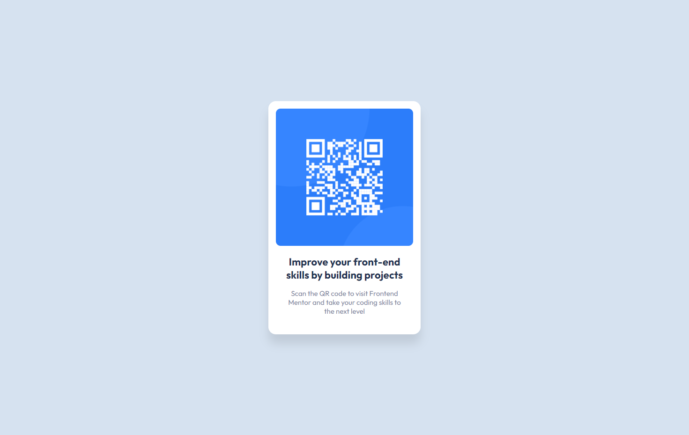

# Frontend Mentor - QR code component solution with React

This is a solution to the [QR code component challenge on Frontend Mentor](https://www.frontendmentor.io/challenges/qr-code-component-iux_sIO_H). Frontend Mentor challenges help you improve your coding skills by building realistic projects. 

## Table of contents

- [Overview](#overview)
  - [Screenshot](#screenshot)
  - [Links](#links)
- [My process](#my-process)
  - [Built with](#built-with)
  - [What I learned](#what-i-learned)
  - [Continued development](#continued-development)
  - [Useful resources](#useful-resources)
- [Author](#author)
- [Acknowledgments](#acknowledgments)

## Overview

### Screenshot

### Links

- Solution URL: [Solution URL]()
- Live Site URL: 

## My process

### Built with

- Semantic HTML5 markup
- CSS custom properties
- Flexbox
- [React](https://reactjs.org/) - JS library

**Note: These are just examples. Delete this note and replace the list above with your own choices**

### What I learned

I learned that writing a web app based on a design is completely different from following tutorials that lay out all the steps already. At times, I would continuously alt+tab to figure out the differences between my component and the image of the design.

### Continued development

I want to practice more base CSS before deciding to move toward CSS frameworks like Tailwind or using React libraries like Material UI or Chakra UI. I also plan to learn how to make more static pages with React using React Hooks before moving on to dynamic pages with Next.js

### Useful resources

- [Modern CSS Solutions](https://moderncss.dev/) - Reference for modern best practices with css
- [React Tutorial App](https://react-tutorial.app/) - The free practice problems to learn the basics of React help reinforce my understanding of React
- [JavaScriptMastery](https://www.youtube.com/c/JavaScriptMastery) - I learned some naming conventions for CSS like the BEM methodology, which helped me get over slumps of not knowing what classname to use, and I followed how he declared variables for colors and fonts.

## Author

- Frontend Mentor - [@iannnop](https://www.frontendmentor.io/profile/iannnop)
- Twitter - [@iannnop](https://www.twitter.com/iannnop)
